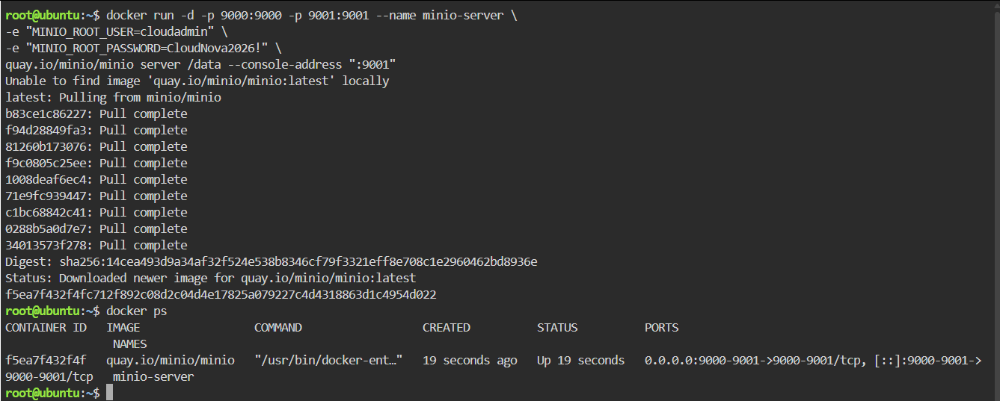
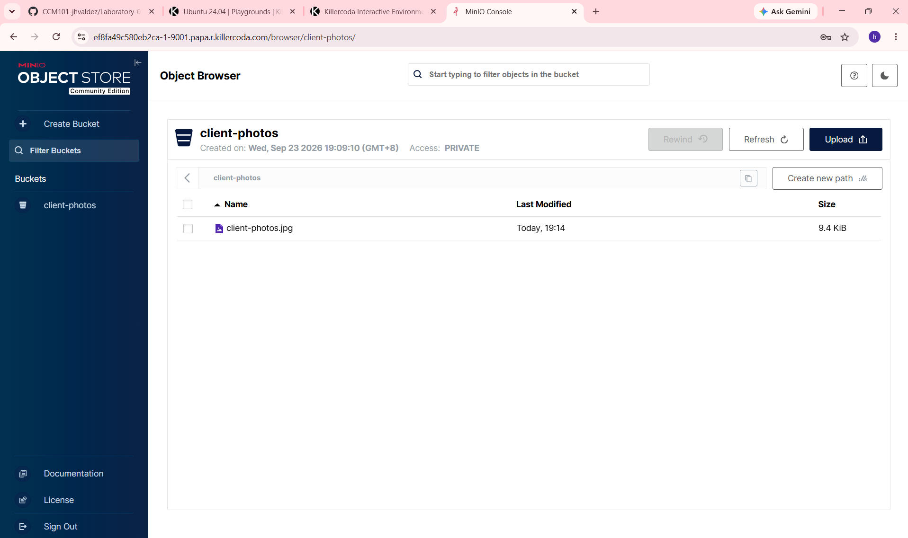

# MinIO Deployment

## Overview

For this activity, I deployed MinIO using Docker in the KillerCoda Ubuntu Playground. MinIO provides S3-compatible object storage that can be accessed through a web console.

## Docker Command

The following Docker command was used to create and start the MinIO server:

```bash
docker run -d -p 9000:9000 -p 9001:9001 --name minio-server \
-e "MINIO_ROOT_USER=cloudadmin" \
-e "MINIO_ROOT_PASSWORD=CloudNova2026!" \
minio/minio server /data --console-address ":9001"
```

## Port Configuration

Two ports were used by the MinIO server:

| Port   | Purpose           |
| ------ | ----------------- |
| `9000` | MinIO API port    |
| `9001` | MinIO Web Console |

The MinIO Web Console was accessed using **port 9001** through the KillerCoda port forwarding feature.

## Verify the Container

After starting MinIO, I checked if the container was running using:

```bash
docker ps
```

The `minio-server` container should appear in the list of running containers.

## Environment Variables

The `-e` flags were used to define environment variables for the MinIO server.

```text
-e "MINIO_ROOT_USER=cloudadmin"
```

This sets the administrator username to `cloudadmin`.

```text
-e "MINIO_ROOT_PASSWORD=CloudNova2026!"
```

This sets the administrator password used to log in to the MinIO Web Console.

## MinIO Console

The MinIO Web Console was accessed through port:

```text
9001
```

After opening the forwarded port, I logged in using the administrator credentials.

## Bucket Created

A bucket named:

```text
client-photos
```

was created in the MinIO Web Console.

A sample file was then uploaded to the bucket to verify that the object storage server was working correctly.

## Screenshots

### MinIO Server Deployment



### Bucket and Uploaded File



